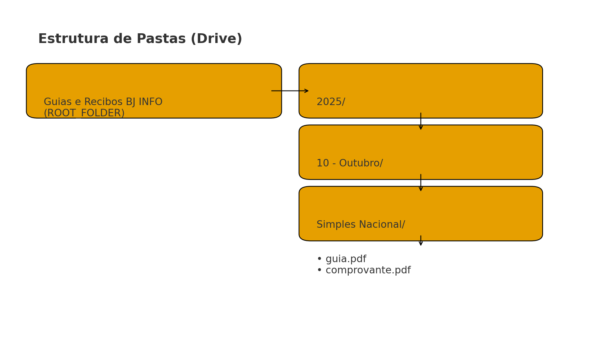
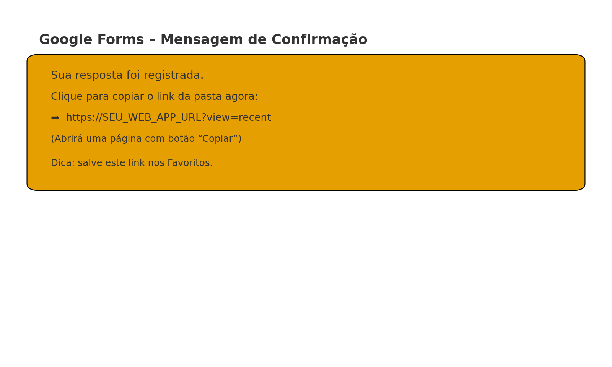
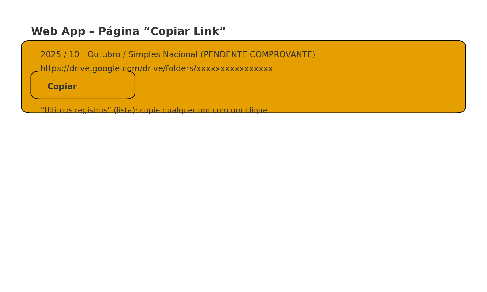

# BJINFO – Controle de Pagamentos  
## Automação de Guias e Recibos (Google Drive + Forms + Apps Script)

---

## 📘 Visão Geral

Este projeto automatiza o **armazenamento e controle de guias e comprovantes de pagamento** da BJINFO Consultoria.  
Com ele, você envia **formularios Google** (um para as guias e outro para os comprovantes), e o sistema organiza tudo automaticamente no **Google Drive**, criando pastas hierárquicas:

```
Guias e Recibos BJ INFO/
  └── 2025/
       └── 10 - Outubro/
            └── Simples Nacional/
                 ├── guia.pdf
                 └── comprovante.pdf
```

Cada registro gera um **link direto para a pasta**, que pode ser usado no sistema contábil.  
O projeto também inclui um **Web App** que exibe uma página com **botão de copiar** para enviar o link diretamente à área de transferência.

---

## 📁 Estrutura do Repositório

```
bjinfo-controle-de-pagamentos/
│
├─ README.md
│
├─ images/
│   ├─ 01_drive_estrutura.png
│   ├─ 02_forms_confirmacao.png
│   └─ 03_webapp_copiar.png
│
├─ checklist/
│   └─ checklist_opcao_A.pdf
│
└─ scripts/
    ├─ main.gs
    └─ copy_page.html
```

---

## 🧩 Estrutura no Google Drive



- **Pasta raiz:** `Guias e Recibos BJ INFO`
- Subpastas automáticas por **ano / mês / descrição**.
- Em cada pasta ficam os arquivos `guia.pdf` e `comprovante.pdf`.

---

## 🧾 Planilha-Mestra

Crie uma planilha chamada **“Registros – Guias e Recibos”** com duas abas:

### Aba `Registros`
Colunas (nesta ordem):

```
UID | Ano | Mês | Descrição | Data inclusão | Dt vencimento | URL Guia | Dt pagamento | URL Comprovante | Pasta ID | Pasta URL | Status
```

### Aba `Catalogo`
Contém os tipos de pagamentos válidos (usados nas listas suspensas do Formulário A):

```
Descricao
Simples Nacional
DAS-MEI
FGTS
INSS
ISS
IRPJ
CSLL
```

---

## 🧮 Formulários Google

### Formulário A – Envio de GUIAS
Campos:
- Ano  
- Mês  
- Descrição do pagamento (lista; vem do Catálogo)  
- Data de vencimento  
- PDF da guia (upload de arquivo)

### Formulário B – Envio de COMPROVANTES
Campos:
- Selecionar registro pendente (lista dinâmica)  
- Data de pagamento  
- PDF do comprovante (upload de arquivo)

---

## ⚙️ Código Apps Script

O código abaixo deve ser colado na **planilha-mestra** em:  
**Extensões → Apps Script → Novo Projeto → Cole e salve.**

> 🔧 Atualize as constantes:
> - `ROOT_FOLDER_ID` → ID da pasta raiz no Drive  
> - `FORM_A_ID` e `FORM_B_ID` → IDs dos Formulários A e B

> 🧩 Crie também um arquivo HTML chamado **`copy_page.html`** (veja mais abaixo).

<details>
<summary>📜 Clique para expandir o código principal (main.gs)</summary>

```javascript
/***** CONFIG GERAIS *****/
const ROOT_FOLDER_ID = 'PASTE_AQUI_ID_DA_PASTA_RAIZ'; // pasta "Guias e Recibos BJ INFO"
const SHEET_NAME = 'Registros';

// IDs dos formulários
const FORM_A_ID = 'PASTE_AQUI_ID_DO_FORM_A';
const FORM_B_ID = 'PASTE_AQUI_ID_DO_FORM_B';

// Títulos exatos dos itens nos Forms
const FORM_B_DROPDOWN_TITLE = 'Selecionar registro pendente';
const FORM_A_FIELDS = {
  ano: 'Ano',
  mes: 'Mês',
  desc: 'Descrição do pagamento',
  dtVenc: 'Data de vencimento',
  guiaFile: 'PDF da guia'
};
const FORM_B_FIELDS = {
  pendente: 'Selecionar registro pendente',
  dtPag: 'Data de pagamento',
  compFile: 'PDF do comprovante'
};

// Mapeamento mês (número -> nome)
const MESES = ['01 - Janeiro','02 - Fevereiro','03 - Março','04 - Abril','05 - Maio','06 - Junho','07 - Julho','08 - Agosto','09 - Setembro','10 - Outubro','11 - Novembro','12 - Dezembro'];

/***** HELPERS *****/
function getSheet_() { return SpreadsheetApp.getActive().getSheetByName(SHEET_NAME); }
function sanitize_(name){ return name.replace(/[\\/:*?"<>|#%&{}$!@`~+=\[\];]/g, '-').trim(); }
function getOrCreateFolderPath_(ano, mesNome, descricao) {
  const root = DriveApp.getFolderById(ROOT_FOLDER_ID);
  const year = getOrCreateSub_(root, sanitize_(String(ano)));
  const month = getOrCreateSub_(year, sanitize_(mesNome));
  const desc = getOrCreateSub_(month, sanitize_(descricao));
  return desc;
}
function getOrCreateSub_(parent, name){ const it = parent.getFoldersByName(name); return it.hasNext() ? it.next() : parent.createFolder(name); }
function moveToFolder_(fileId, targetFolder){
  const file = DriveApp.getFileById(fileId);
  targetFolder.addFile(file);
  const parents = file.getParents();
  while (parents.hasNext()){
    const p = parents.next();
    if (p.getId() !== targetFolder.getId()) p.removeFile(file);
  }
}
function monthIndexFromLabel_(label){
  const nomes = ['janeiro','fevereiro','março','marco','abril','maio','junho','julho','agosto','setembro','outubro','novembro','dezembro'];
  const i = nomes.findIndex(n => n === String(label).toLowerCase());
  if (i >= 0) return i;
  const num = parseInt(label,10); if (!isNaN(num) && num>=1 && num<=12) return num-1;
  throw new Error('Mês inválido: ' + label);
}
function key_(ano, mesNome, descricao){ return `${ano}||${mesNome}||${descricao}`.toLowerCase(); }
function ensureUidForRow_(rowValues){ if (!rowValues[0]) rowValues[0] = Utilities.getUuid(); return rowValues[0]; }
function findRowByUid_(uid){
  const sh = getSheet_(), data = sh.getDataRange().getValues();
  for (let i=1;i<data.length;i++){ if (String(data[i][0])===String(uid)) return i+1; }
  return -1;
}
function findRowByKey_(ano, mesNome, descricao){
  const sh = getSheet_(), data = sh.getDataRange().getValues(), target=key_(ano, mesNome, descricao);
  for (let i=1;i<data.length;i++){
    const Ano=data[i][1], Mes=data[i][2], Desc=data[i][3];
    if (key_(Ano, Mes, Desc)===target) return i+1;
  }
  return -1;
}

/***** FORM A: GUIA (onSubmit) *****/
// Gatilho instalável: Ao enviar formulário (Form A)
function onSubmitGuia(e){
  const ano = e.namedValues[FORM_A_FIELDS.ano][0];
  const mesLabel = e.namedValues[FORM_A_FIELDS.mes][0];
  const desc = e.namedValues[FORM_A_FIELDS.desc][0];
  const dtVenc = e.namedValues[FORM_A_FIELDS.dtVenc][0];
  const guiaFileId = e.namedValues[FORM_A_FIELDS.guiaFile][0].match(/[-\w]{25,}/)[0];

  assertDescricaoValida_(desc);

  const mesIndex = monthIndexFromLabel_(mesLabel);
  const mesNome = MESES[mesIndex];

  const pasta = getOrCreateFolderPath_(ano, mesNome, desc);
  moveToFolder_(guiaFileId, pasta);

  const pastaUrl = `https://drive.google.com/drive/folders/${pasta.getId()}`;
  const guiaUrl = `https://drive.google.com/file/d/${guiaFileId}/view`;

  const sh = getSheet_();
  const now = new Date();
  const row = findRowByKey_(ano, mesNome, desc);

  if (row === -1){
    const values = [
      '', ano, mesNome, desc, now, dtVenc, guiaUrl,
      '', '', pasta.getId(), pastaUrl, 'PENDENTE COMPROVANTE'
    ];
    sh.appendRow(values);
    const lastRow = sh.getLastRow();
    const uid = Utilities.getUuid();
    sh.getRange(lastRow, 1).setValue(uid);
  } else {
    const rowValues = sh.getRange(row, 1, 1, 12).getValues()[0];
    const uid = ensureUidForRow_(rowValues);
    sh.getRange(row, 1).setValue(uid);
    sh.getRange(row, 4).setValue(now);
    sh.getRange(row, 5).setValue(dtVenc);
    sh.getRange(row, 6).setValue(guiaUrl);
    sh.getRange(row,10).setValue(pasta.getId());
    sh.getRange(row,11).setValue(pastaUrl);
    sh.getRange(row,12).setValue('PENDENTE COMPROVANTE');
  }

  // Atualiza o dropdown do Form B
  refreshFormBOptions_();
}

/***** FORM B: COMPROVANTE (onSubmit) *****/
// Gatilho instalável: Ao enviar formulário (Form B)
function onSubmitComprovante(e){
  const pendenteOption = e.namedValues[FORM_B_FIELDS.pendente][0];  // "UID-... | 2025 / 10 - Outubro / Simples Nacional (venc ...)"
  if (/Nenhum pendente/.test(pendenteOption)) return;

  const dtPag = e.namedValues[FORM_B_FIELDS.dtPag][0];
  const compFileId = e.namedValues[FORM_B_FIELDS.compFile][0].match(/[-\w]{25,}/)[0];

  const uid = String(pendenteOption).split('|')[0].trim();

  const row = findRowByUid_(uid);
  if (row === -1) throw new Error('Registro não encontrado para UID: ' + uid);

  const sh = getSheet_();
  const values = sh.getRange(row, 1, 1, 12).getValues()[0];
  const [, ano, mesNome, desc] = values;

  const pasta = getOrCreateFolderPath_(ano, mesNome, desc);
  moveToFolder_(compFileId, pasta);

  const compUrl = `https://drive.google.com/file/d/${compFileId}/view`;
  sh.getRange(row, 8).setValue(dtPag);
  sh.getRange(row, 9).setValue(compUrl);
  sh.getRange(row,10).setValue(pasta.getId());
  sh.getRange(row,11).setValue(`https://drive.google.com/drive/folders/${pasta.getId()}`);
  sh.getRange(row,12).setValue('CONCLUÍDO');

  refreshFormBOptions_();
}

/***** ATUALIZA DROPDOWN DO FORM B *****/
function refreshFormBOptions_(){
  const sh = getSheet_();
  const data = sh.getDataRange().getValues();
  const header = data[0];
  const IDX_UID = header.indexOf('UID');
  const IDX_ANO = header.indexOf('Ano');
  const IDX_MES = header.indexOf('Mês');
  const IDX_DESC = header.indexOf('Descrição');
  const IDX_VENC = header.indexOf('Dt vencimento');
  const IDX_STATUS = header.indexOf('Status');

  const options = [];
  for (let i = 1; i < data.length; i++){
    const row = data[i];
    const status = String(row[IDX_STATUS] || '').toUpperCase();
    if (status === 'PENDENTE COMPROVANTE'){
      const uid = row[IDX_UID], ano=row[IDX_ANO], mes=row[IDX_MES], desc=row[IDX_DESC];
      const venc = row[IDX_VENC] ? Utilities.formatDate(new Date(row[IDX_VENC]), Session.getScriptTimeZone(), 'dd/MM/yyyy') : '—';
      options.push(`${uid} | ${ano} / ${mes} / ${desc} (venc ${venc})`);
    }
  }

  const form = FormApp.openById(FORM_B_ID);
  const items = form.getItems(FormApp.ItemType.LIST);
  const dropdown = items.find(it => it.getTitle() === FORM_B_DROPDOWN_TITLE);
  if (!dropdown) throw new Error('Item "'+FORM_B_DROPDOWN_TITLE+'" não encontrado no Form B.');
  dropdown.asListItem().setChoiceValues(options.length ? options : ['Nenhum pendente no momento']);
}

/***** CATÁLOGO (descrições controladas no Form A) *****/
const CATALOG_SHEET = 'Catalogo';
const CATALOG_COL_HEADER = 'Descricao';

function refreshFormADescricoes_(){
  const ss = SpreadsheetApp.getActive();
  const sh = ss.getSheetByName(CATALOG_SHEET);
  if (!sh) throw new Error('Aba "'+CATALOG_SHEET+'" não encontrada.');

  const range = sh.getDataRange().getValues();
  if (!range || range.length < 2) throw new Error('Inclua descrições no Catalogo (abaixo do cabeçalho).');

  const header = range[0].map(h => String(h).trim());
  const idxDesc = header.indexOf(CATALOG_COL_HEADER);
  if (idxDesc === -1) throw new Error('Cabeçalho "'+CATALOG_COL_HEADER+'" não encontrado.');

  const set = new Set();
  for (let i = 1; i < range.length; i++){
    const v = String(range[i][idxDesc] || '').trim();
    if (v) set.add(v);
  }
  const descricoes = Array.from(set).sort((a,b)=>a.localeCompare(b,'pt-BR'));

  const formA = FormApp.openById(FORM_A_ID);
  const items = formA.getItems(FormApp.ItemType.LIST);
  const alvo = items.find(it => it.getTitle() === FORM_A_FIELDS.desc);
  if (!alvo) throw new Error('Campo "'+FORM_A_FIELDS.desc+'" não encontrado no Form A.');
  alvo.asListItem().setChoiceValues(descricoes);
}

function assertDescricaoValida_(descricao){
  const ss = SpreadsheetApp.getActive();
  const sh = ss.getSheetByName(CATALOG_SHEET);
  const range = sh.getDataRange().getValues();
  const header = range[0].map(h => String(h).trim());
  const idxDesc = header.indexOf(CATALOG_COL_HEADER);
  const set = new Set();
  for (let i = 1; i < range.length; i++){
    const v = String(range[i][idxDesc] || '').trim();
    if (v) set.add(v);
  }
  if (!set.has(descricao)) throw new Error('Descrição inválida: "'+descricao+'". Atualize o catálogo.');
}

/***** WEB APP – “Copiar agora” *****/
function getWebAppBaseUrl_(){ return ScriptApp.getService().getUrl(); }
function buildCopyPageUrlByUid_(uid){ return getWebAppBaseUrl_() + '?uid=' + encodeURIComponent(uid); }
function buildCopyPageUrlList_(){ return getWebAppBaseUrl_() + '?view=recent'; }

// Página do Web App
function doGet(e){
  const uid = e.parameter.uid || null;
  const view = e.parameter.view || null;
  const html = HtmlService.createTemplateFromFile('copy_page');
  html.uid = uid;
  html.view = view;
  html.data = (uid ? getRecordByUid_(uid) : getRecentRecords_(20));
  return html.evaluate()
    .setTitle('Copiar link da pasta')
    .setXFrameOptionsMode(HtmlService.XFrameOptionsMode.ALLOWALL);
}

function getRecordByUid_(uid){
  const sh = getSheet_(), data = sh.getDataRange().getValues(), header=data[0];
  const idx = {
    uid: header.indexOf('UID'), ano: header.indexOf('Ano'), mes: header.indexOf('Mês'),
    desc: header.indexOf('Descrição'), pastaUrl: header.indexOf('Pasta URL'), status: header.indexOf('Status')
  };
  for (let i=1;i<data.length;i++){
    if (String(data[i][idx.uid])===String(uid)){
      return [{ uid: data[i][idx.uid],
        title: `${data[i][idx.ano]} / ${data[i][idx.mes]} / ${data[i][idx.desc]}`,
        pastaUrl: data[i][idx.pastaUrl], status: data[i][idx.status] }];
    }
  }
  return [];
}

function getRecentRecords_(limit){
  const sh = getSheet_(), data = sh.getDataRange().getValues(), header=data[0];
  const idx = {
    uid: header.indexOf('UID'), ano: header.indexOf('Ano'), mes: header.indexOf('Mês'),
    desc: header.indexOf('Descrição'), pastaUrl: header.indexOf('Pasta URL'),
    status: header.indexOf('Status'), dataInc: header.indexOf('Data inclusão')
  };
  const rows = [];
  for (let i=1;i<data.length;i++){
    rows.push({ uid: data[i][idx.uid],
      title: `${data[i][idx.ano]} / ${data[i][idx.mes]} / ${data[i][idx.desc]}`,
      pastaUrl: data[i][idx.pastaUrl], status: data[i][idx.status],
      dataInc: data[i][idx.dataInc] ? new Date(data[i][idx.dataInc]) : null });
  }
  rows.sort((a,b)=>(b.dataInc?.getTime()||0)-(a.dataInc?.getTime()||0));
  return rows.slice(0, limit);
}

/***** GATILHOS AUXILIARES (opcionais) *****/
function initRefreshNow(){ refreshFormBOptions_(); }
function createHourlyRefreshTrigger(){
  ScriptApp.newTrigger('refreshFormBOptions_').timeBased().everyHours(1).create();
}
function createDailyCatalogRefreshTrigger(){
  ScriptApp.newTrigger('refreshFormADescricoes_').timeBased().atHour(6).everyDays(1).create();
}

```
</details>

<details>
<summary>🌐 Clique para expandir o HTML do Web App (copy_page.html)</summary>

```html
<!DOCTYPE html>
<html>
  <head>
    <meta charset="utf-8">
    <meta name="viewport" content="width=device-width,initial-scale=1">
    <title>Copiar link</title>
    <style>
      body { font-family: Arial, sans-serif; margin: 24px; }
      .card { border: 1px solid #ddd; border-radius: 8px; padding: 16px; margin-bottom: 12px; }
      .title { font-weight: 600; margin-bottom: 8px; }
      button { padding: 10px 14px; border: 0; border-radius: 6px; cursor: pointer; }
      .copy { background: #1a73e8; color: #fff; }
      .ok { color: #1a73e8; font-weight: 600; display:none; margin-left:8px; }
      a { word-break: break-all; }
      .muted { color: #666; font-size: 12px; }
    </style>
  </head>
  <body>
    <? if (uid && data.length === 1) { var r = data[0]; ?>
      <div class="card">
        <div class="title"><?= r.title ?> (<?= r.status ?>)</div>
        <div><a id="link" href="<?= r.pastaUrl ?>" target="_blank"><?= r.pastaUrl ?></a></div>
        <div style="margin-top:12px;">
          <button class="copy" onclick="copy()">Copiar link da pasta</button>
          <span id="ok" class="ok">Copiado!</span>
        </div>
        <div class="muted" style="margin-top:8px;">Dica: adicione esta página aos Favoritos para acesso rápido.</div>
      </div>
      <div style="margin-top:16px;">
        <a href="?view=recent">Ver últimos registros</a>
      </div>
    <? } else { ?>
      <h3>Últimos registros</h3>
      <? if (data.length === 0) { ?>
        <p>Sem registros.</p>
      <? } else { data.forEach(function(r){ ?>
        <div class="card">
          <div class="title"><?= r.title ?> (<?= r.status ?>)</div>
          <div><a href="<?= r.pastaUrl ?>" target="_blank"><?= r.pastaUrl ?></a></div>
          <div style="margin-top:12px;">
            <button class="copy" data-url="<?= r.pastaUrl ?>" onclick="copyFromAttr(this)">Copiar</button>
            <a style="margin-left:8px;" href="?uid=<?= r.uid ?>">abrir individual</a>
            <span class="ok">Copiado!</span>
          </div>
        </div>
      <? }); } ?>
    <? } ?>
    <script>
      async function copy(){
        try {
          const url = document.getElementById('link').href;
          await navigator.clipboard.writeText(url);
          const el = document.getElementById('ok');
          el.style.display='inline'; setTimeout(()=>el.style.display='none',1500);
        } catch (e) {
          alert('Não foi possível copiar automaticamente. Copie manualmente: ' + document.getElementById('link').href);
        }
      }
      async function copyFromAttr(el){
        try {
          const url = el.getAttribute('data-url');
          await navigator.clipboard.writeText(url);
          const ok = el.parentNode.querySelector('.ok');
          if (ok){ ok.style.display='inline'; setTimeout(()=>ok.style.display='none',1500); }
        } catch (e) {
          alert('Não foi possível copiar automaticamente. Copie manualmente.');
        }
      }
    </script>
  </body>
</html>

```
</details>

> 💡 Dica: para preservar a formatação no GitHub, mantenha os blocos entre crases triplas (```)  
> ou coloque os arquivos em `/scripts/main.gs` e `/scripts/copy_page.html`.

---

## 🌐 Publicação do Web App

1. No editor do Apps Script, clique em  
   **Implantar → Implantar como aplicativo da Web**
2. Configure:
   - **Executar como:** *Você mesmo*  
   - **Quem tem acesso:** *Qualquer pessoa com o link*
3. Copie a URL gerada (exemplo):
   ```
   https://script.google.com/macros/s/AKfycby2.../exec
   ```
4. Essa será a **URL do Web App**, usada na mensagem de confirmação dos formulários.

---

## ✅ Configurando os Gatilhos

No editor do Apps Script (ícone ⏰ “Acionadores”):

| Função                 | Tipo de gatilho     | Dispara de | Observação |
|------------------------|--------------------|-------------|-------------|
| `onSubmitGuia`         | Ao enviar formulário | Formulário A | Move guia e cria pasta |
| `onSubmitComprovante`  | Ao enviar formulário | Formulário B | Anexa comprovante |
| `refreshFormADescricoes_` | Manual / Diário | — | Atualiza catálogo |
| `refreshFormBOptions_` | Manual / Horário | — | Atualiza lista de pendentes |
| `initRefreshNow`       | Manual (1x) | — | Primeira atualização |

---

## 🧾 Mensagem de Confirmação (Forms)

Após o envio, o usuário verá um link **“Copiar agora”** que abre o Web App e exibe os últimos registros.

### Exemplo visual


**Texto sugerido:**
```
Sua resposta foi registrada.
Clique aqui para Copiar o link da pasta agora:
https://SEU_WEB_APP_URL?view=recent
```

---

## 💻 Página do Web App – “Copiar Link”



- Exibe os **últimos registros** (pendentes ou concluídos).  
- Cada item mostra:
  - Nome da competência (ano/mês/descrição)
  - Link da pasta
  - Botão **Copiar**
- Ao clicar em “Copiar”, o link é enviado diretamente à **área de transferência**.

---

## 🧪 Testando o Sistema

1. **Envie uma guia** no Form A.  
   - O script cria as pastas automaticamente e atualiza a planilha.  
2. Clique em **“Copiar agora”** → Web App → **Copiar** → cole no sistema contábil.  
3. **Depois do pagamento**, envie o comprovante no Form B.  
   - O registro é atualizado como **CONCLUÍDO**.  
   - O mesmo link mostra **guia + comprovante** na pasta.  
4. Confira o status na planilha:
   - PENDENTE COMPROVANTE → CONCLUÍDO

---

## 📦 Checklist Resumido

[📄 Baixar Checklist (PDF)](checklist/checklist_opcao_A.pdf)

---

## 🔒 Permissões e Dicas

- Os arquivos enviados pelo Forms são movidos para o Drive da pasta raiz.  
- Se outras pessoas precisarem acessar:
  - Defina a pasta raiz como **“Qualquer pessoa com o link – Leitor”**.  
- O link da pasta é seguro e serve como **referência contábil**.

---

## 🧠 Créditos

**Autor:** João Mariano – BJINFO Consultoria  
**Tecnologias:** Google Drive API (DriveApp), Google Forms, Google Apps Script, HTML  
**Licença:** Livre para uso e adaptação.

---

© 2025 BJINFO Consultoria – Todos os direitos reservados.
